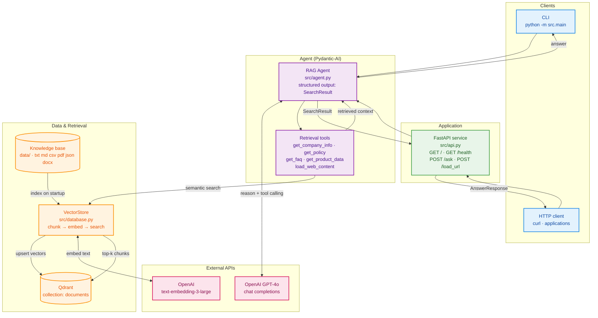

# Pydantic-AI RAG Agent

[](https://github.com/SergeyGer/pydantic-ai-rag-agent/actions/workflows/ci.yml)
[](LICENSE)


AI agent for documentation analysis. A small but complete **RAG
(Retrieval-Augmented Generation)** sample that demonstrates structured output
validation and tool-calling with **Pydantic-AI**.

## Overview

**Pydantic-AI RAG Agent** is a compact, production-minded reference
implementation of a Retrieval-Augmented Generation service. It answers
natural-language questions strictly from *your own* documents and returns a
**validated, structured answer** instead of free-form prose.

The end-to-end flow is intentionally small and explicit:

1. **Ingest** — documents in `data/` (`.txt`, `.md`, `.csv`, `.pdf`, `.json`,
   `.docx`) or a web page are loaded and split into overlapping
   `500`-character chunks.
2. **Embed** — every chunk is embedded with OpenAI `text-embedding-3-large`
   (3072 dimensions) and upserted into a **Qdrant** collection.
3. **Retrieve** — at query time the Pydantic-AI agent calls one of its typed
   retrieval tools to run a semantic search over the collection.
4. **Answer** — the model composes an answer grounded in the retrieved context
   and returns it as a `SearchResult` carrying `answer`, `sections`, `sources`
   and `confidence`.

Key highlights:

- **Structured output** — the agent's response is validated against a Pydantic
  model, not parsed out of free text.
- **Tool calling** — retrieval is exposed as typed tools, keeping the model
  grounded in your knowledge base.
- **Two interfaces** — an interactive CLI (`python -m src.main`) and a FastAPI
  service (`POST /ask`, `POST /load_url`, `GET /health`).
- **Pluggable storage** — external Qdrant via URL or host/port, with an
  automatic in-memory fallback for a self-contained demo.
- **Container-ready** — a hardened, non-root, read-only Docker image runnable
  with Docker Compose.

## Architecture

The diagram below shows how a request flows from a client through the agent and
its retrieval tools into the vector store, and how the knowledge base is indexed
at startup.



## Tech Stack

- **Framework:** [Pydantic-AI](https://ai.pydantic.dev/) `1.107.5`
- **LLM:** OpenAI GPT-4o (chat) + `text-embedding-3-large` (embeddings)
- **Vector store:** Qdrant `1.19` (external server, with an in-memory fallback)
- **API:** FastAPI `0.141` + Uvicorn `0.52`
- **Environment:** Docker & Docker Compose
- All dependency versions are pinned in [`requirements.txt`](requirements.txt).

## Project structure

```
.
├── src/
│   ├── agent.py      # Pydantic-AI agent + retrieval tools (structured output)
│   ├── api.py        # FastAPI service (/ask, /load_url, /health)
│   ├── database.py   # VectorStore: loading, chunking, embedding, search
│   ├── main.py       # Interactive CLI
│   ├── models.py     # Shared Pydantic models (SearchResult, AnswerResponse, ...)
│   └── __init__.py
├── tests/            # Unit tests (pytest), run fully offline
├── scripts/          # Manual integration scripts (require a running API)
├── data/             # Knowledge base documents (txt, md, csv, pdf, json, docx)
├── .env.example      # Template for the environment configuration
├── .dockerignore     # Keeps secrets/caches out of the image
├── Dockerfile
└── docker-compose.yml
```

## Setup

1. Copy the environment template and fill in your OpenAI key:

   ```bash
   cp .env.example .env
   ```

   ```env
   OPENAI_API_KEY=sk-...
   ```

2. Install dependencies:

   ```bash
   pip install -r requirements.txt
   ```

3. Put your knowledge-base files into the `data/` directory. Supported formats:
   `.txt`, `.md`, `.csv`, `.pdf`, `.json`, `.docx`.

## Running

### Docker Compose (API + Qdrant)

```bash
docker-compose up --build
```

This starts two services:

- **qdrant** – the vector database (persisted in the `qdrant_storage` volume),
- **app** – the FastAPI service, exposed on **http://localhost:8000**.

Health checks and startup order:

- **qdrant** is probed over HTTP at `GET /readyz` (the official image ships no
  `curl`, so the check performs the request via `bash`'s `/dev/tcp`);
- **app** is probed at `GET /health`;
- the app waits for Qdrant to become **healthy** before starting
  (`depends_on: qdrant: condition: service_healthy`).

The application container is hardened:

- it runs as an **unprivileged user** (`appuser`, uid 1000);
- the root filesystem is **read-only** (`read_only: true`), with a writable
  `/tmp` provided via `tmpfs`;
- privilege escalation is blocked with `security_opt: no-new-privileges:true`;
- `data/` is mounted **read-only** (documents are only read at index time).

Secrets and caches are kept out of the build context via `.dockerignore`
(incl. `.env`, `.env.*`, `.env.example`).

### CLI

Run from the project root (the `src` package must be importable):

```bash
python -m src.main
```

### API (local)

```bash
python -m src.api
```

The service listens on port `8000` by default. Override it with `API_PORT`.

## API endpoints

| Method | Path        | Description                                   |
|--------|-------------|-----------------------------------------------|
| `GET`  | `/`         | Service info                                  |
| `GET`  | `/health`   | Health probe (used by Docker)                 |
| `POST` | `/ask`      | Ask a question, returns a structured answer   |
| `POST` | `/load_url` | Fetch a URL and index it for later queries    |

Example:

```bash
curl -X POST http://localhost:8000/ask \
  -H "Content-Type: application/json" \
  -d '{"question": "What is the company vacation policy?"}'
```

```json
{
  "answer": "...",
  "sections": ["...", "..."],
  "sources": ["policy.txt"],
  "confidence": 0.83
}
```

## Environment variables

| Variable           | Default               | Description                                                       |
|--------------------|-----------------------|-------------------------------------------------------------------|
| `OPENAI_API_KEY`   | –                     | **Required.** OpenAI API key.                                     |
| `API_PORT`         | `8000`                | Port for the FastAPI/uvicorn server.                              |
| `DATA_DIR`         | `<project_root>/data` | Directory scanned for knowledge-base documents.                   |
| `QDRANT_URL`       | –                     | Full URL of a Qdrant instance (e.g. Qdrant Cloud). Takes priority.|
| `QDRANT_HOST`      | –                     | Host of a Qdrant server. Empty ⇒ in-memory Qdrant.                |
| `QDRANT_PORT`      | `6333`                | Port used together with `QDRANT_HOST`.                            |
| `QDRANT_API_KEY`   | –                     | API key for a secured/Qdrant Cloud instance.                      |
| `QDRANT_COLLECTION`| `documents`           | Name of the Qdrant collection.                                    |

The storage backend is selected at startup:

1. `QDRANT_URL` set → connect by URL (hosted Qdrant);
2. else `QDRANT_HOST` set → connect by host/port;
3. otherwise → **in-memory** Qdrant (nothing is persisted).

## Tests

Unit tests run fully offline (embeddings are stubbed and an in-memory Qdrant is
forced):

```bash
pip install -r requirements-dev.txt
pytest
```

The scripts in `scripts/` are **manual** integration checks and require a
running API (`python -m src.api`) or network access.

## Notes and limitations

- The container runs as a **non-root** user with a read-only root filesystem
  (a writable `/tmp` is provided via `tmpfs`), `no-new-privileges` is enabled,
  and the `data/` directory is bind-mounted read-only.
- Documents are indexed on startup **only if the collection is empty**, so an
  external Qdrant keeps its index across restarts (and avoids re-embedding).
  To re-index, drop the collection or change `QDRANT_COLLECTION`.
- Startup indexing is **best-effort**: if it fails (invalid `OPENAI_API_KEY`, a
  transient OpenAI/network outage, unreadable files, ...) a detailed error (with
  traceback) is logged and the service still starts with a possibly empty/partial
  index - it does not crash-loop. Fix the cause and restart, or load content via
  `POST /load_url`.
- With the in-memory fallback (no `QDRANT_HOST`/`QDRANT_URL`) the knowledge base
  is re-indexed on every start and does not span multiple worker processes.
- The Qdrant `/readyz` health check relies on bash's `/dev/tcp` because the
  official Qdrant image does not include an HTTP client.
- `confidence` is a simple average of the embedding similarity scores of the
  retrieved chunks (clamped to `0..1`).
